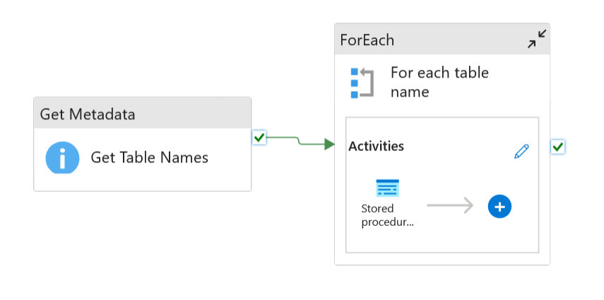

# End-to-End ETL Data Pipeline for Real-Time Analytics

## **Overview**
This project implements an **end-to-end ETL data pipeline** that:
- **Extracts** data from a local SQL Server database.
- **Transforms** and cleans the data into a business-ready format for analytics.
- **Loads** the processed data into a **Power BI dashboard** for **real-time analytics**.

The pipeline was designed with scalability and maintainability in mind, leveraging **Azure Cloud Services** and following the **Medallion Architecture** approach for batch data processing.

## **Goals of the project**
- Get familiar with Azure cloud environment and offered data services
- Gain an understanding of architecture for batch data processing using medallion architectue
- Obtain hands-on experience with working with cloud data warehouses and data orchestration tools

## **Architecture**

## **Key Features**
- **Seamless Cloud Integration** – Built and deployed the pipeline entirely in the **Azure Cloud Environment**, leveraging Azure Data Factory, Azure Data Lake, and Azure Databricks.  
- **Layered Data Processing** – Implemented the **Medallion Architecture** (Bronze, Silver, Gold layers) for structured batch data processing and improved data quality.  
- **Scalable Data Orchestration** – Designed workflows in Azure Data Factory to handle large-scale data ingestion and transformation with minimal manual intervention.  
- **Robust Data Transformation** – Applied cleaning, formatting, and enrichment techniques to deliver reliable, analytics-ready datasets.  
- **Real-Time Insights** – Connected the final datasets to **Power BI** dashboards for interactive and near real-time analytics, supporting quick business decision-making.  

## **Technologies Used**
- **Database**: SQL Server
- **Cloud Platform**: Microsoft Azure
- **Data Orchestration**: Azure Data Factory
- **Data Storage**: Azure Data Lake Storage
- **Data Processing**: Azure Databricks
- **Visualization**: Power BI

## **Setup & Deployment**

### **Prerequisites**
- Microsoft Azure account with access to:
  - **Azure Data Factory**
  - **Azure Data Lake Storage**
  - **Azure Databricks**
- SQL Server database with sample or production data.
- Power BI Desktop or Power BI Service account.
- Azure CLI (optional for automation).

### **Step 1 — Data Extraction**
1. Connect **Azure Data Factory** to the local SQL Server database.
2. Create a **Linked Service** for SQL Server and Azure Data Lake Storage.
3. Configure a **Copy Data Activity** to move raw data into the **Bronze Layer** in Azure Data Lake.

### **Step 2 — Data Transformation**
1. Use **Azure Databricks** to process data from the Bronze Layer.
2. Apply cleaning, formatting, and enrichment steps to produce **Silver Layer** datasets.
3. Create aggregated, analytics-ready datasets for the **Gold Layer**.

### **Step 3 — Data Loading to Power BI**
1. Connect Power BI to the **Gold Layer** datasets in Azure Data Lake or Azure Synapse.
2. Design interactive dashboards and enable scheduled refresh for near real-time updates.

### **Step 4 — Orchestration & Automation**
1. Schedule pipeline runs in Azure Data Factory.
2. Monitor pipeline execution and configure alerts for failures.
3. Implement version control using GitHub integration with Data Factory & Databricks notebooks.

### **Step 5 — Testing & Optimization**
- Test with sample datasets before production.
- Monitor performance and optimize transformations.
- Ensure security with Azure Role-Based Access Control (RBAC).

